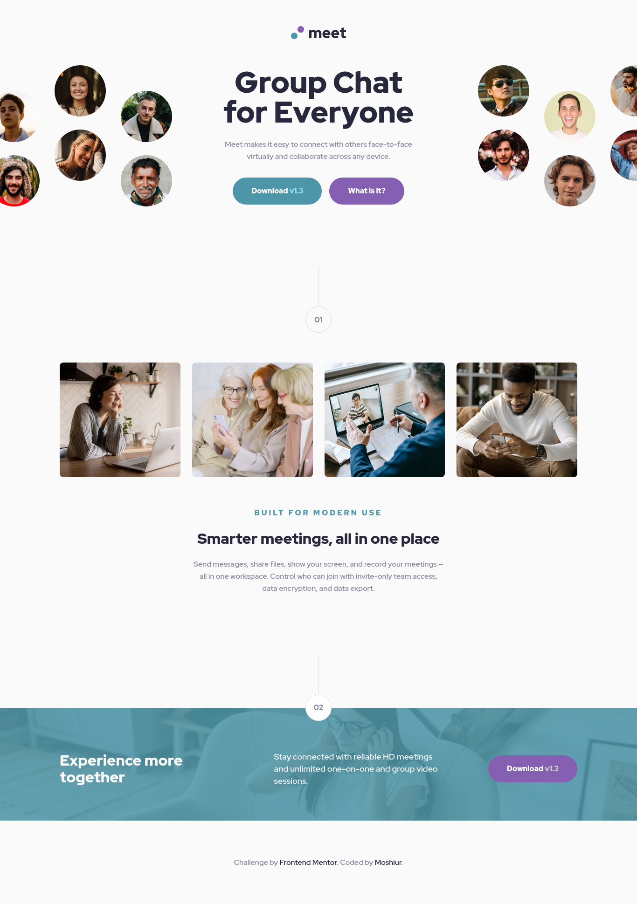

# Frontend Mentor - Meet landing page

## Overview

### Screenshot

#### Desktop



### Links

- Solution URL: []()
- Live Site URL: [https://codermoshiur.github.io/meet-landing-page/](https://codermoshiur.github.io/meet-landing-page/)

## My process

### Built with

- Semantic HTML5 markup
- CSS Grid
- CSS Flexbox
- Sass

### Usage

This website is built with HTML, CSS and [Sass](https://sass-lang.com).

In order to customize this website, you need to install [Node.js](https://nodejs.org/en). Then, clone this repository and run:

```bash
  npm install
```

This will install Sass. To build your css files from Sass, run:

```bash
  npm run sass:compile
```

To watch your Sass files for changes, run:

```bash
  npm run sass:watch
```

To add your own custom styles, use the `style.scss` files.

## Author

- Website - [Moshiur](https://codersfoundation.com)
- Youtube - [@moshiur](https://www.youtube.com/moshiur)
- Facebook - [@codermoshiur](https://www.facebook.com/codermoshiur)
- Frontend Mentor - [@codermoshiur](https://www.frontendmentor.io/profile/codermoshiur)
